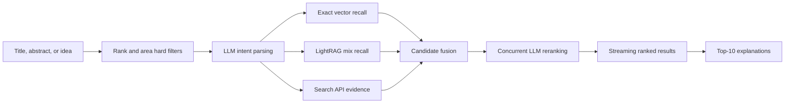

<p align="center">
  <strong>English</strong> · <a href="README_zh.md">中文</a>
</p>

<h1 align="center">where paper go</h1>

<p align="center">
  <strong>Quality-first venue discovery for clear and fuzzy research topics</strong><br>
  A graph-based recommendation system combining LightRAG, exact vector retrieval, LLM reasoning, and live search evidence.
</p>

<p align="center">
  <a href="https://www.python.org/"></a>
  <a href="https://github.com/rudykon/where_paper_go/actions/workflows/tests.yml"></a>
  <a href="#retrieval-pipeline"></a>
  <a href="#data-coverage"></a>
  <a href="LICENSE"></a>
</p>

<p align="center">
  <a href="#overview">Overview</a> ·
  <a href="#retrieval-pipeline">Pipeline</a> ·
  <a href="#quick-start">Quick Start</a> ·
  <a href="#data-coverage">Data</a> ·
  <a href="#repository-map">Repository</a> ·
  <a href="#license">License</a>
</p>

> [!IMPORTANT]
> **where paper go is a venue-discovery assistant, not an acceptance predictor.** Rankings express topic fit within the available data. Always verify the latest aims and scope, Call for Papers, deadlines, and submission rules on the official venue website.

<a id="overview"></a>
## Overview

where paper go turns a paper title, abstract, keyword set, or early research idea into a ranked list of conferences and journals. It is designed for both precise technical descriptions and fuzzy, cross-domain expressions that keyword dictionaries alone cannot cover.

| Goal | Approach | Output |
| --- | --- | --- |
| Respect submission constraints | Hard-filter by ranking system, tier, venue type, and research area | Only eligible venues enter retrieval |
| Recall diverse topic expressions | LLM intent parsing + multilingual embeddings + LightRAG graph paths | Broad candidates for clear or fuzzy queries |
| Keep recommendations grounded | Search API evidence + reviewed scope records + known venue facts | Evidence-linked results instead of invented venues |
| Make ranking understandable | Multi-signal fusion, LLM reranking, and explanations for the top 10 | Scores, matched concepts, graph paths, and reasons |

Key product behavior:

- CCF, TH-CPL, CAS, and JCR targets can be combined; multiple target tiers use **OR** semantics.
- Topic retrieval strictly uses **LightRAG + exact vector retrieval + LLM + Search API**. It does not silently downgrade when one layer fails.
- Search, vector, and LightRAG work are parallelized; LLM reranking uses two concurrent batches.
- Complete results and API responses are cached, while the web UI streams progress and available recommendations.
- The runtime query layer is a rebuildable file-based property graph—no Neo4j service is required.

<a id="retrieval-pipeline"></a>
## Retrieval pipeline



The file-based property graph stores venues, tiers, topics, reviewed scopes, exclusions, and evidence as nodes and edges. Source CSV/TSV files remain the auditable facts; graph, vector, LightRAG, and cache files are rebuildable artifacts and are excluded from Git.

See [retrieval architecture](docs/retrieval-architecture.md) for scoring, failure boundaries, caching, and storage details.

<a id="quick-start"></a>
## Quick start

### 1. Install

```bash
git clone https://github.com/rudykon/where_paper_go.git
cd where_paper_go

python3 -m venv .venv
source .venv/bin/activate
python3 -m pip install --upgrade pip
python3 -m pip install -e .
```

### 2. Configure the required APIs

```bash
cp api.example.json llmapi.json
```

Edit `llmapi.json` and complete all three sections:

| Section | Purpose | Typical choice |
| --- | --- | --- |
| `llm` | Query understanding, candidate reranking, explanations | OpenAI-compatible chat model |
| `embedding` | Multilingual semantic vectors | bge-m3 or another multilingual embedding model |
| `search` | Current scope/CFP evidence | Tavily, Brave, Bing, or SerpAPI |

`llmapi.json` is ignored by Git. Never put real credentials in `api.example.json`.

### 3. Build the retrieval artifacts

```bash
python3 -m scripts.prepare_retrieval --api-config llmapi.json
```

This creates the property graph, exact venue vectors, and the LightRAG `mix` knowledge base. The first build can take time; later runs reuse the artifacts and embedding cache.

### 4. Start the web app

```bash
where-paper-go-web --host 0.0.0.0 --port 8000
```

Open `http://127.0.0.1:8000/` locally, or `http://<server-ip>:8000/` over SSH/LAN. The interface supports Chinese/English switching, combined scope filters, persistent retrieval progress, streamed results, and evidence details.

<details>
<summary><strong>CLI examples</strong></summary>

List all CCF-A venues without running the API-assisted topic pipeline:

```bash
where-paper-go --target CCF-A --all
```

Recommend venues for a fuzzy research description:

```bash
where-paper-go \
  --target 'CCF-A或者THCPL-A或者中科院1区' \
  --query 'A general framework for heterogeneous supervision with missing labels, uncertainty, conflicts, hierarchies, and multitask learning' \
  --api-config llmapi.json \
  --limit 20
```

Search JCR Q1–Q4 journals in medicine:

```bash
where-paper-go \
  --target 'JCR-Q1,JCR-Q2,JCR-Q3,JCR-Q4' \
  --record-type journal \
  --area medicine \
  --query-file abstract.txt \
  --api-config llmapi.json
```

Machine-readable output is available through `--format json` and `--format csv`. Run `where-paper-go --help` for every option.

</details>

<a id="data-coverage"></a>
## Data coverage

| Ranking source | Edition | Records | Venue type | Tiers |
| --- | ---: | ---: | --- | --- |
| CCF | 2026 | 386 | Conferences | A / B / C |
| TH-CPL | 2019 | 406 | Conferences and journals | A / B |
| CAS journal partition | 2025 | 21,772 | Journals | 1 / 2 / 3 / 4 |
| JCR | 2025 | 22,643 | Journals | Q1 / Q2 / Q3 / Q4 / N/A |

The reviewed fine-grained scope catalog covers all 58 CCF-A conferences, all 117 TH-CPL-A venues, and all 53 CAS Zone 1 computer-science journals. Overlapping venues reuse one reviewed scope record, so these counts should not be added as unique entities.

Source details and validation rules are documented in [`data/README.md`](data/README.md). Ranking names, third-party data, and source descriptions remain subject to their respective terms.

<a id="validation"></a>
## Validation

```bash
PYTHONDONTWRITEBYTECODE=1 python3 -m unittest discover -s tests -v
python3 -m scripts.benchmark_retrieval
```

The test suite covers target expressions, source counts, entity merging, graph integrity, fuzzy graph paths, exact semantic recall, LightRAG references, API constraints, streaming behavior, caching, and representative topic rankings.

<a id="repository-map"></a>
## Repository map

| Path | Purpose |
| --- | --- |
| `where_paper_go/` | Retrieval, graph, LLM/search integration, web server, and frontend |
| `scripts/` | Graph/LightRAG builds, enrichment, migration, and benchmarks |
| `tests/` | Unit, integration, and retrieval-quality tests |
| `data/` | Auditable ranking and reviewed-scope source data |
| `docs/` | Architecture, frontend, enrichment, and legacy-index notes |
| `papers/` | Research-paper metadata; PDF files are not version controlled |
| `api.example.json` | Credential-free API configuration template |

Useful documentation:

- [Retrieval architecture](docs/retrieval-architecture.md)
- [Web frontend and deployment](docs/web-frontend.md)
- [Scope enrichment workflow](docs/enrichment.md)
- [Legacy SQLite migration notes](docs/legacy-sqlite-index.md)

<a id="security"></a>
## Security and privacy

- `llmapi.json`, `api.json`, `github_token.json`, `.env*`, generated indexes, caches, and local PDFs are excluded by `.gitignore`.
- Topic queries, candidate names, and selected scope text are sent to the configured LLM, embedding, and search providers.
- Before submitting unpublished abstracts, review the retention and training policies of those providers.
- Search text is treated as untrusted evidence; venue identity and ranking facts cannot be created by the LLM.

<a id="license"></a>
## License

Repository-authored source code is licensed under the [Apache License 2.0](LICENSE). Data files, ranking names, papers, generated artifacts, and third-party dependencies may have separate terms.
