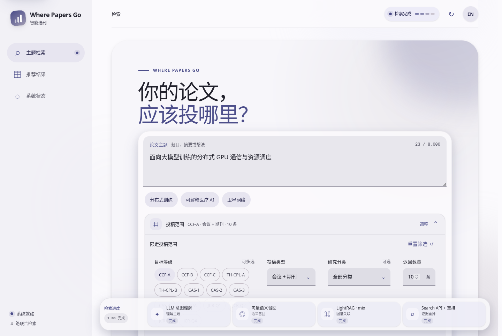
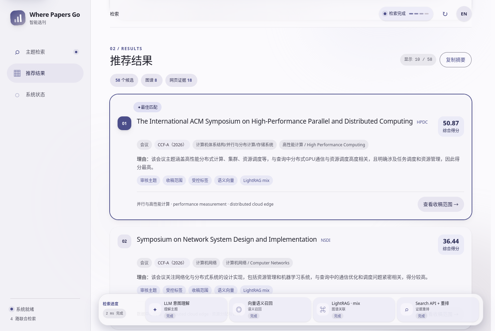
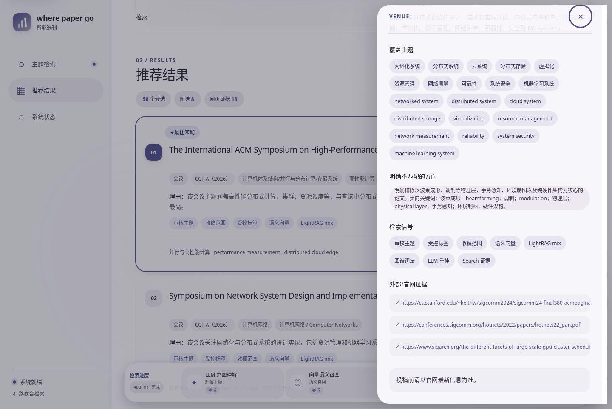
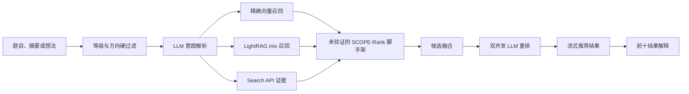

<p align="center">
  <a href="README.md">English</a> · <strong>中文</strong>
</p>

<p align="center">
  
</p>
<h1 align="center">Where Papers Go</h1>

<p align="center">
  <strong>面向明确主题与模糊研究想法的质量优先投稿目标检索</strong><br>
  融合 LightRAG、精确向量召回、大模型推理与实时搜索证据的图谱推荐系统。
</p>

<p align="center">
  <a href="https://www.python.org/"></a>
  <a href="https://github.com/rudykon/Where_Papers_Go/actions/workflows/tests.yml"></a>
  <a href="#retrieval-pipeline"></a>
  <a href="#data-coverage"></a>
  <a href="LICENSE"></a>
</p>

<p align="center">
  <a href="#overview">项目概览</a> ·
  <a href="#product-tour">功能展示</a> ·
  <a href="#retrieval-pipeline">检索流水线</a> ·
  <a href="#quick-start">快速开始</a> ·
  <a href="#data-coverage">数据覆盖</a> ·
  <a href="#repository-map">项目结构</a> ·
  <a href="#license">许可证</a>
</p>

> [!IMPORTANT]
> **Where Papers Go 是投稿目标发现工具，不是录用率预测器。** 排名仅表示候选在现有数据中的主题适配程度。投稿前仍需到会刊官网核对最新收稿范围、Call for Papers、截止日期和格式要求。

<a id="overview"></a>
## 项目概览

Where Papers Go 将论文题目、摘要、关键词或尚未定型的研究想法转换为会议与期刊推荐列表。系统同时面向明确的技术描述和跨学科、口语化的模糊表达，避免只靠关键词字典造成漏检。

| 目标 | 实现方式 | 输出 |
| --- | --- | --- |
| 严格遵守投稿限制 | 按榜单、等级、会刊类型和研究方向硬过滤 | 只有符合范围的会刊进入召回 |
| 覆盖多样主题表达 | LLM 意图解析 + 多语言向量 + LightRAG 图路径 + 查询自适应通道预算 | 对明确或模糊主题进行广泛召回 |
| 推荐有事实依据 | Search API 证据 + 人工审核范围 + 已知会刊事实 | 输出带证据的真实候选，不由模型虚构会刊 |
| 排名可以理解 | 多路融合、LLM 重排、前十结果解释 | 展示得分、概念命中、图路径和推荐理由 |

核心行为：

- 支持 CCF、TH-CPL、中科院和 JCR，多个目标等级之间是**或**关系。
- 主题检索强制使用 **LightRAG + 精确向量召回 + LLM + Search API**，任一层失败时不会静默降级。
- Search、向量和 LightRAG 并行执行，LLM 候选重排采用双并发批次。
- **SCOPE-Rank 目前只是未验证的研究脚手架**：它根据 LLM 给出的模糊度/跨学科信号和通道实时覆盖自适应分配召回配额，尚不是已有实验结论支持的排序方法；旧的固定配额作为显式消融对照保留。
- 完整结果和 API 响应均可缓存；Web 端持续显示检索状态，并流式输出可用结果。
- 在线查询使用可重建的文件化属性图谱，不需要 Neo4j 服务。

<a id="product-tour"></a>
## 功能展示与使用步骤

Web 界面把主题描述、投稿范围、推荐结果和证据核验集中在一个响应式工作区中。

| 自然语言检索 | 全程可见进度 | 可核验推荐依据 |
| --- | --- | --- |
| 用明确或模糊表达描述论文，并组合投稿限制。 | 页面滚动到任意位置，底部检索进度仍保持可见。 | 打开任一结果，查看收稿边界、召回信号和外部证据。 |

### 1. 描述研究并限定投稿范围

输入论文题目、摘要或研究想法；需要限制等级、会刊类型、研究分类或返回数量时，再展开“投稿范围”。

<p align="center">
  
</p>

### 2. 边检索边查看推荐结果

推荐结果会陆续进入页面；无论滚动到哪里，底部进度条都会显示 LLM 意图理解、向量召回、LightRAG 和 Search API 的状态。

<p align="center">
  
</p>

### 3. 核对收稿范围与证据

点击“查看收稿范围”，对照覆盖主题、明确排除方向、参与排序的检索信号和外部或官方证据，再决定是否投稿。

<p align="center">
  
</p>

<p align="center"><sub>截图来自当前运行系统的缓存示例查询；源数据和 API 更新后，推荐顺序与证据可能变化。</sub></p>

<a id="retrieval-pipeline"></a>
## 检索流水线



文件化属性图保存会刊、等级、主题、审核范围、排除边界和证据之间的节点与关系。CSV/TSV 是可审计事实源；属性图、向量、LightRAG 库和查询缓存都是可重建产物，不进入 Git。

精确余弦召回使用启动时预加载的 NumPy 矩阵，同时保留标量实现用于质量回归对照。矩阵构建成本由 Web worker 启动阶段承担，不占用用户首次查询。

评分、失败边界、缓存和存储设计详见[检索架构](docs/retrieval-architecture.md)。

<a id="quick-start"></a>
## 快速开始

### 1. 安装

```bash
git clone https://github.com/rudykon/Where_Papers_Go.git
cd Where_Papers_Go

python3 -m venv .venv
source .venv/bin/activate
python3 -m pip install --upgrade pip
python3 -m pip install -e .
```

### 2. 配置必需的 API

```bash
cp api.example.json llmapi.json
```

编辑 `llmapi.json`，完整配置以下三节：

| 配置节 | 用途 | 常见选择 |
| --- | --- | --- |
| `llm` | 理解查询、候选重排、生成解释 | OpenAI 兼容对话模型 |
| `embedding` | 多语言语义向量 | bge-m3 或其他多语言向量模型 |
| `search` | 获取最新收稿范围和 CFP 证据 | Tavily、Brave、Bing 或 SerpAPI |

`llmapi.json` 已被 Git 忽略。请勿把真实密钥写入 `api.example.json`。
多个 Tavily Key 请统一放入 `search.api_keys`。持久化 Key 池会记录各 Key 的额度、
轮换游标、冷却和耗尽状态，状态文件不会保存明文密钥。

### 3. 构建检索库

```bash
python3 -m scripts.prepare_retrieval --api-config llmapi.json
```

该命令会建立属性图、会刊精确向量和 LightRAG `mix` 知识库。首次构建需要一定时间，后续运行会复用索引与 embedding 缓存。

### 4. 启动 Web 界面

```bash
where-paper-go-web --host 0.0.0.0 --port 8000
```

本机访问 `http://127.0.0.1:8000/`；通过 SSH 或局域网使用时访问 `http://<服务器IP>:8000/`。界面支持中英文切换、投稿范围组合筛选、常驻检索进度、流式结果和证据详情。

<details>
<summary><strong>命令行示例</strong></summary>

仅列出全部 CCF-A 投稿目标，不运行 API 增强主题检索：

```bash
where-paper-go --target CCF-A --all
```

根据模糊研究描述推荐投稿目标：

```bash
where-paper-go \
  --target 'CCF-A或者THCPL-A或者中科院1区' \
  --query '跨模态、跨标签粒度，统一处理缺失标签、不确定性、标签冲突、层级关系和多任务监督的通用异构监督学习框架' \
  --api-config llmapi.json \
  --limit 20
```

在医学方向检索 JCR Q1–Q4 期刊：

```bash
where-paper-go \
  --target 'JCR-Q1,JCR-Q2,JCR-Q3,JCR-Q4' \
  --record-type journal \
  --area 医学 \
  --query-file abstract.txt \
  --api-config llmapi.json
```

可通过 `--format json` 和 `--format csv` 获取机器可读输出。运行 `where-paper-go --help` 查看全部参数。

</details>

<a id="data-coverage"></a>
## 数据覆盖

| 榜单来源 | 版本 | 记录数 | 类型 | 等级 |
| --- | ---: | ---: | --- | --- |
| CCF | 2026 | 386 | 会议 | A / B / C |
| TH-CPL | 2019 | 406 | 会议与期刊 | A / B |
| 中科院期刊分区 | 2025 | 21,772 | 期刊 | 1 / 2 / 3 / 4 区 |
| JCR | 2025 | 22,643 | 期刊 | Q1 / Q2 / Q3 / Q4 / N/A |

细粒度审核范围已覆盖全部 58 个 CCF-A 会议、117 个 TH-CPL-A 投稿目标和 53 个中科院 1 区计算机科学大类期刊。跨榜单重复会刊复用同一条审核范围，因此这些数量不能直接相加为唯一实体数。

本地已完成截止 2026-03-31 的候选侧采集快照：20,087 个 JCR Q1--Q4 期刊画像全部存在，其中 19,593 个具有历史论文证据（97.54%）。这些被 Git 忽略的研究产物与上述产品审核 scope 是两个不同口径；其 PCL 派生画像在用于论文结论前，仍必须通过因果时间重建和冻结 run 契约。

数据来源与校验规则见 [`data/README.md`](data/README.md)。榜单名称、第三方数据和来源描述仍遵循各自的使用条款。

<a id="validation"></a>
## 验证

```bash
PYTHONDONTWRITEBYTECODE=1 python3 -m unittest discover -s tests -v
python3 -m scripts.benchmark_retrieval
```

测试覆盖等级表达式、源记录数量、实体合并、图谱完整性、模糊图路径、精确语义召回、LightRAG 引用、API 约束、流式输出、缓存和代表性主题排序。

### 无泄漏离线论文评测

`research` 包将论文实验与在线产品链路隔离：它不导入、也不调用 LLM/Search 客户端，所有检索失败都保留在分母中，会刊档案冻结在训练截止日，并在评分前审计 DOI、标题和时间泄漏。

```bash
python3 -m research build-cached-corpus \
  --cache-dir benchmark_artifacts/recent_journals/crossref_cache \
  --jcr-csv data/jcr_partition_2025.csv \
  --output-dir benchmark_artifacts/research_20260814/cached_crossref \
  --start 2026-01-01 --train-end 2026-03-31 \
  --dev-end 2026-05-31 --test-end 2026-06-30

python3 -m research evaluate \
  --config research/configs/cached_crossref_baselines.json
```

已提交的配置包含 BM25、TF-IDF、RRF 和仅在训练集拟合的线性融合。向量、图或 LightRAG 的冻结运行结果也可以通过同一接口导入。任务定义、强基线、消融、统计方法和结论边界见 [CCF-A 研究化路线图](docs/ccf-a-research-roadmap.md)。

<a id="repository-map"></a>
## 项目结构

| 路径 | 用途 |
| --- | --- |
| `where_paper_go/` | 检索、图谱、LLM/Search 集成、Web 服务和前端 |
| `research/` | 离线时间评测、泄漏审计、基线、融合、指标和可复现配置 |
| `scripts/` | 图谱/LightRAG 建库、补全、迁移和性能基准 |
| `tests/` | 单元、集成和检索效果测试 |
| `data/` | 可审计榜单与人工审核范围源数据 |
| `docs/` | 架构、前端、数据补全、旧索引说明和产品截图 |
| `papers/` | 研究论文元数据；PDF 不进入版本控制 |
| `api.example.json` | 不含真实密钥的 API 配置模板 |

常用文档：

- [检索架构](docs/retrieval-architecture.md)
- [Web 前端与部署](docs/web-frontend.md)
- [收稿范围补全流程](docs/enrichment.md)
- [CCF-A 研究化路线图](docs/ccf-a-research-roadmap.md)
- [性能与离线效果评测](docs/performance-evaluation-2026-08-14.md)
- [旧 SQLite 迁移说明](docs/legacy-sqlite-index.md)

<a id="security"></a>
## 安全与隐私

- `llmapi.json`、`api.json`、`github_token.json`、`.env*`、生成索引、缓存和本地 PDF 均被 `.gitignore` 排除。
- 主题查询、候选名称和部分收稿范围会发送给所配置的 LLM、embedding 与搜索服务商。
- 提交未公开摘要前，请先检查服务商的数据留存和模型训练政策。
- 搜索文本仅作为不可信证据；LLM 无权创建会刊实体或修改榜单事实。

<a id="license"></a>
## 许可证

本仓库自行编写的源代码采用 [Apache License 2.0](LICENSE)。数据文件、榜单名称、论文、生成产物和第三方依赖可能适用其他条款。
